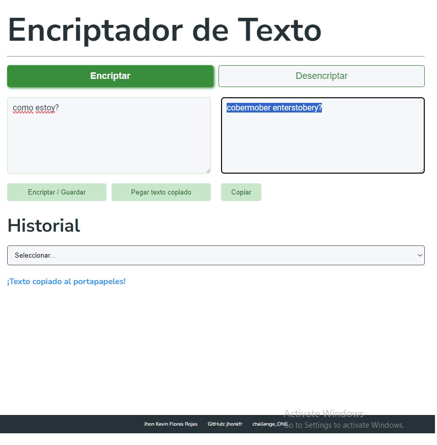
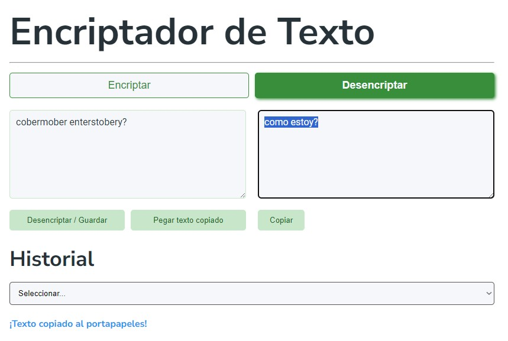
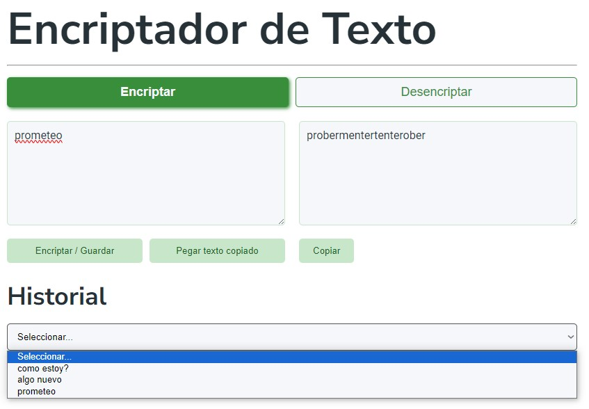
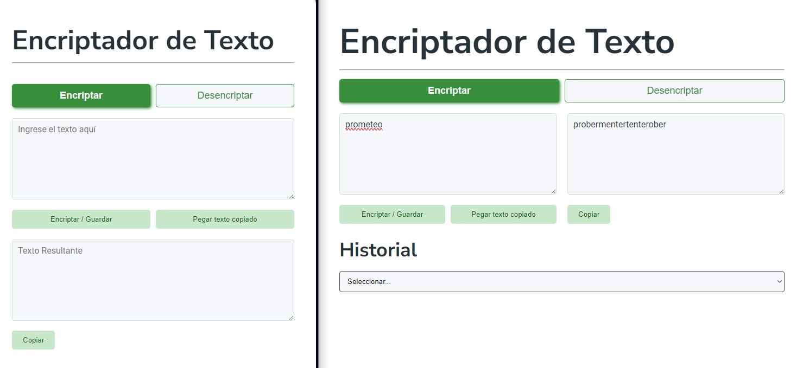

# Challenge ONE: Encriptador/Desencriptador de Texto

Este proyecto es un encriptador y desencriptador de texto desarrollado como parte del challenge ONE (Oracle Next Education). Permite a los usuarios encriptar y desencriptar mensajes

## Funcionalidades

### 1. Encriptación de Texto

- Los usuarios pueden ingresar texto en un área designada.
- Al hacer clic en "Encriptar", el texto se codifica según las siguientes reglas:
  - La letra "e" se convierte en "enter"
  - La letra "i" se convierte en "imes"
  - La letra "a" se convierte en "ai"
  - La letra "o" se convierte en "ober"
  - La letra "u" se convierte en "ufat"

### 2. Desencriptación de Texto

- Los usuarios pueden ingresar texto encriptado en el área de entrada (izquierda - web, superior - movil).
- Al hacer clic en "Desencriptar", el texto se decodifica utilizando las mismas reglas en reversa.

### 3. Copiar al Portapapeles

- Cuando se da click en encriptar y desencriptar el texto resultante ya se copia al portapapeles.
- Adicionalmente, los usuarios pueden copiar fácilmente el resultado al portapapeles con un solo clic.

### 4. Pegar desde el Portapapeles

- Funcionalidad para pegar texto directamente desde el portapapeles al área de entrada.

### 5. Historial de Entradas

- El sistema mantiene un historial de textos ingresados, tanto para encriptación como para desencriptación.
- Los usuarios pueden seleccionar entradas previas del historial para reutilizarlas.

### 6. Diseño Responsivo

- La interfaz se adapta a diferentes tamaños de pantalla, ofreciendo una experiencia óptima tanto en dispositivos de escritorio como móviles.

## Tecnologías Utilizadas

- HTML5
- CSS3
- JavaScript

## Desarrollador

- Jhon Kevin Flores Rojas
- GitHub: [jhonkfr](https://github.com/jhonkfr)

Este proyecto es parte del challenge ONE (Oracle Next Education).
